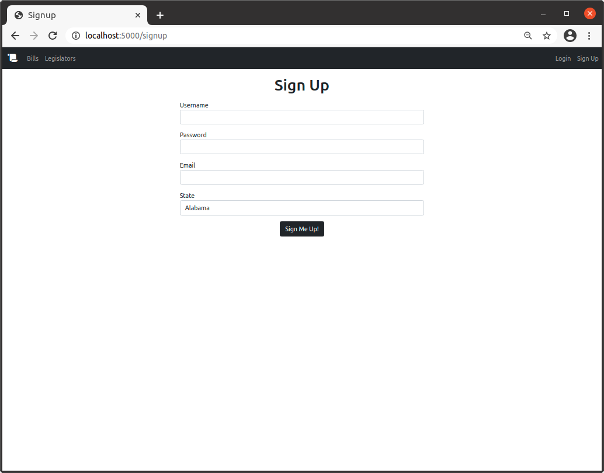
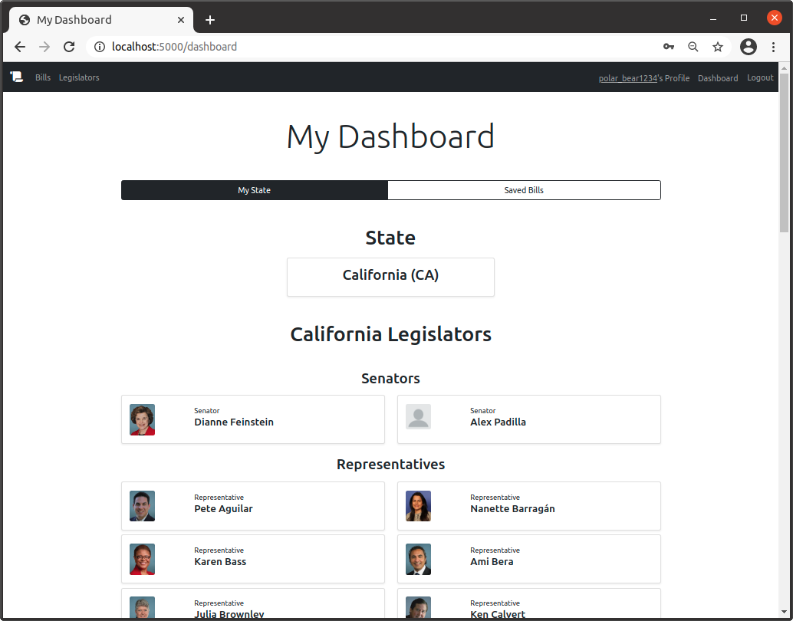
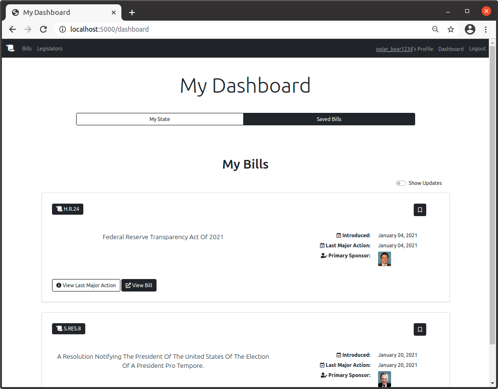

# BLZ - US Congress Visibility App

---

### Table of Contents

* [About](###about)
* [Installation](###about)
* [Features](###about)
* [Examples](###about)
* [API](###about)
* [Contact](###about)
* [Sources](###about)
* [Contribute](###contribute)

---

### About

#### 
Did you know that every year US Congress introduces an average of 11,000 bills? [[1](https://www.ndpanalytics.com/45-years-of-congress-bills),[2](congress.gov)]

    

#### 
........ 
  
   

#### 
:mag: How many have you read? 
  

#### 
........ 
  

   

It isn't always possible to keep completely on top of all national legislation, but BLZ makes it easier. With the BLZ app, you can access a dashboard which shows you all your state's senators and representatives, so you can see what legislation they have sponsored recently. You can also browse legislation by policy area and specify a date range that you would like to search by. You can easily save bills to your dashboard, so you can keep tabs on them, and easily access information about their most recent updates. You can also quickly move from any bill on the app, to the bill page on the congress.gov website so you can find out even more. 

---

### Installation
Download clone the repo.
` git instructions `

Create a virtual environment in the repo directory.
`$ python3 -m venv venv`

Start the environment
`$ source venv/bin/activate`

Install required packages
`$ pip3 install requirements.txt`

Initialize the database
`$ flask init_app`

Run the app (dev or production mode?)
`$ flask run`

Open web browser go to local host 5000 or whatever.

---

### Features

**Browse current legislation.**

   

**Search bills by subject**

**Create an account. Delete it whenever you want.**

**Access Your Dashboard** Where you can find your state's legislators and bills you have saved. 

Save bills to your dashboard.

Click on your legislators to see what legislation they have sponsored recently.

Use the legislator search to find out information about legislators outside of your state.

---

### Examples

---

### API

---

### Contact

---

### Sources

bootstrap
fontawesome
propublica
---

### Contribute