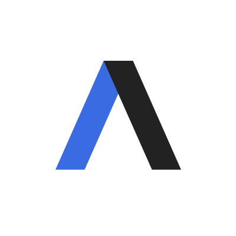
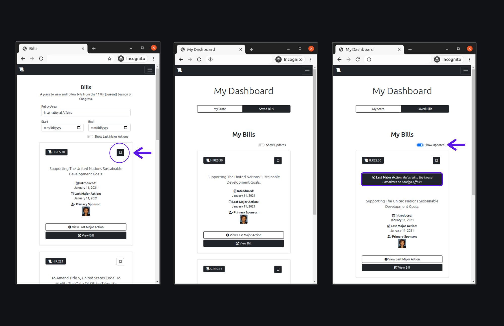

# BLZ - US Congress Visibility App

<a href="https://www.python.org/" title="Python"></a> <a href="https://developer.mozilla.org/en-US/docs/Web/JavaScript" title="JavaScript"></a> <a href="https://git-scm.com/" title="Git"></a> <a href="https://www.w3.org/TR/html5/" title="HTML5"></a> <a href="https://www.w3.org/TR/CSS/" title="CSS3"></a> <a href="https://code.visualstudio.com/" title="Visual Studio Code"></a> <a href="https://www.npmjs.com/package/axios" title="AXIOS"></a> <a href="https://www.heroku.com/" title="Heroku"></a> <a href="https://www.postgresql.org/" title="Postgres"></a> <a href="https://getbootstrap.com/" title="Bootstrap"></a> <a href="https://fontawesome.com/" title="FontAwesome"></a> <a href="https://jquery.com/" title="jQuery"> </a> <a href="https://flask.palletsprojects.com/en/1.1.x/" title="Flask"></a> <a href="https://www.sqlalchemy.org/" title="Git"></a> <a href="https://wtforms.readthedocs.io/en/2.3.x/#" title="WTForms"></a>


## Table of Contents

* [About](###about)
* [Installation](###about)
* [Features](###about)
* [Examples](###about)
* [API](###about)
* [Contact](###about)
* [Sources](###about)
* [Contribute](###contribute)


## About

### <div align='center'>Did you know that every year US Congress introduces an average of 11,000 bills? <sup>[</sup>[<sup>1</sup>](https://www.ndpanalytics.com/45-years-of-congress-bills)<sup>,</sup>[<sup>2</sup>](congress.gov)<sup>]</sup></div>


<br>   

### <div align='center'>........ </div>  
<br>  

### <div align='center'>:mag: How many have you read? </div>  


### <div align='center'>........ </div>  

<br>  

It can be difficult to keep on top of all national legislation, but BLZ makes it easier. With the BLZ app, you can access a dashboard which shows you all your state's senators and representatives, so you can see what legislation they have sponsored recently. You can also browse legislation by policy area and specify a date range that you would like to search by. You can easily save bills to your dashboard, so you can keep tabs on them, and easily access information about their most recent updates. You can also quickly move from any bill on the app, to the bill's page on the official congress website so you can learn more.


#### <div align='center'>[Try the App Here](www.blz.herokuapp.com)</div>  

## Installation

Get a free API key from ProPublica
```sh
https://www.propublica.org/datastore/api/propublica-congress-api
```

Clone the repo.
```sh
https://github.com/erikamanning/capstone1.git
```

Create a virtual environment in the repo directory.
```sh 
$ python3 -m venv venv
```

Start the virtualenvironment.
```sh
$ source venv/bin/activate
```

Install required packages.
```sh
$ pip3 install requirements.txt
```

Create a secrets.py file and add your API key.
<sub> In *secrets.py*</sub>
```sh
API_SECRET_KEY = 'YOUR_SECRET_KEY'
```

Initialize the database.
```sh
$ flask init_app
```

Set the environment to development mode.
```sh
$ export FLASK_ENV=development 
```

Run the app (dev or production mode?)
```sh 
$ flask run
```

Open web browser go to local host 5000 or whatever.


## Features


## User Flows



#### Browse Bills by Subject
#### Use the legislator browse feature to discover new legislators and connect with them on social media.
#### Create an Account and Access Your Dashboard. Here you can find your state's legislators and bills you have saved. 
#### Save bills to your dashboard.


## API


This project owes a lot to [ProPublica Logo](https://projects.propublica.org/api-docs/congress-api/). All ll congressional data was obtained through the ProPublica Congress API.

## Contact


## Technology Stack

* Python
* Flask
* AJAX
* Javascript
* HTML
* CSS
* Bootstrap


## Sources

bootstrap
fontawesome
propublica

## Contribute